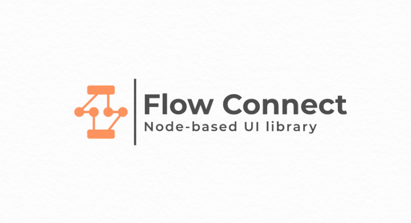
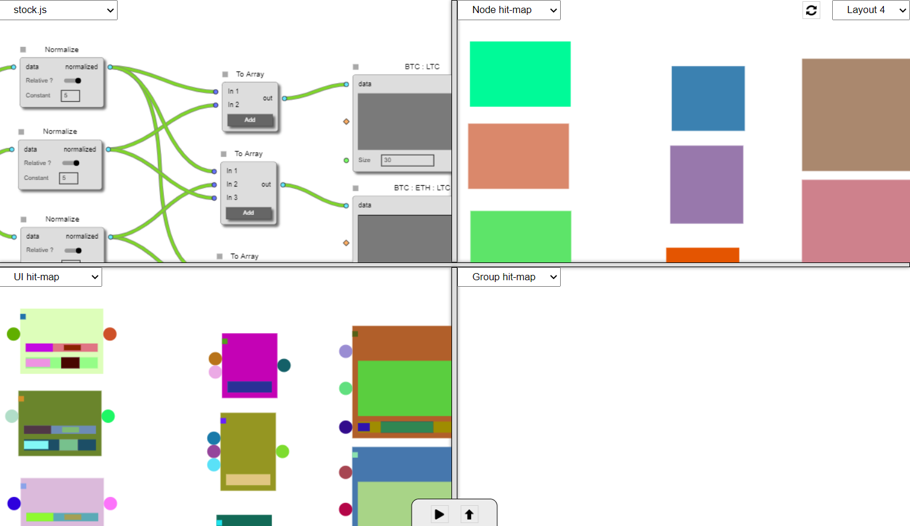

<p align="center">

</p>

<p align="center">
<a href="https://github.com/saurabh-prosoft/flow-connect/actions/workflows/release.yml">

</a>
<a href="https://bundlephobia.com/package/flow-connect"></a>
<a href="https://www.npmjs.com/package/flow-connect"></a>
<a href="https://github.com/saurabh-prosoft/flow-connect/commits/main"></a>
</p>

<p align="center">
FlowConnect is a highly-customizable library for creating node-based editors, graphs and diagrams.
</p>

\
\
\
:globe_with_meridians: [Docs](https://flow-connect.saurabhagat.me)

:mag: [Guide](https://flow-connect.saurabhagat.me/guide)

:books: [API](https://flow-connect.saurabhagat.me/reference/api)
\
<br/>

## Installation

#### NPM or Yarn

```bash
npm i flow-connect
```

```bash
yarn add flow-connect
```

#### CDN

```html
<script src="https://cdn.jsdelivr.net/npm/flow-connect@latest/dist/flow-connect.js"></script>
```

<br/>

## Example Usage

ESM

#### Note: Seperate dependency required for '@flow-connect/\*' packages, check [flow-connect-standard-nodes](https://github.com/saurabh-prosoft/flow-connect-standard-nodes) monorepo for further details.

<br/>

```js
import { FlowConnect, Vector } from "flow-connect";
```

Example

```js
const flowConnect = new FlowConnect(canvasElement);

const flow = flowConnect.createFlow({ name: "New Flow" }, rules: {});

const timer = flow.createNode('common/timer', Vector.create(50, 50), {
  state: { delay: 500 },
});
const log = flow.createNode('common/log', Vector.create(250, 100), {});

timer.outputs[0].connect(log.inputs[0]);

flowConnect.render(flow);
flow.start();
```

<br/>

## Testing

Run unit tests using [Jest](https://jestjs.io/docs/getting-started)

```bash
npm run test
```

<br/>

## Build

Build UMD, ESM and CommonJS modules

```bash
npm run build
```

or

```bash
npm run build:cjs
```

```bash
npm run build:esm
```

```bash
npm run build:umd
```

<br/>

## Docs

Develop & Build docs using [VuePress](https://v2.vuepress.vuejs.org/)

### Develop Docs

```bash
npm run docs:dev
```

### Build Docs

```bash
npm run docs:build
```

<br/>

## Local development

All the local development setup is pre-configured under `/dev` with tools that provides seamless development experience.



<br/>

- Create a new script that you want to test in `dev/scripts/examples`

- Run local developement setup

```bash
npm run dev
```

- All the scripts defined in above directory will be available to test

## Feedback

Feel free to send any feedback on <saurabhbhagat98die@gmail.com>

<br/>

[MIT](./LICENSE) licensed

Copyright &copy; 2021-present | Saurabh Bhagat
